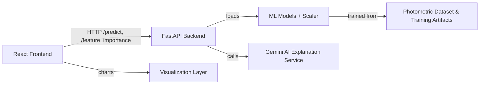

<p align="center">
  
</p>

# NebulaLens — ML & DL Enhanced Stellar Classification

## Overview

NebulaLens is an intelligent platform for astronomical object classification, spectral feature analysis, and immersive visualization of deep-space data. The system is designed to convert photometric measurements into scientific predictions and present those results through an interactive browser experience.

Built for data scientists, astronomers, and technical stakeholders, NebulaLens addresses the challenge of scaling celestial object classification beyond manual inspection. It pairs a modern React-based frontend with a machine learning inference backend, enabling real-time experimentation on astrophysical feature vectors.

## Key Features

- AI-assisted astronomical object classification
- Ensemble inference across multiple model families
- Deep Learning and classical supervised models
- Interactive feature input and prediction UI
- Model agreement and consensus reporting
- Feature importance visualization
- Natural-language explanation generation via a generative AI service
- Responsive visualization layer with charts and exploratory components

## Architecture

NebulaLens is organized as a two-tier application with a browser-based frontend and a Python inference backend.

- User Interface: React + Vite SPA serving navigation, model pages, and a visualizer
- Image Processing Pipeline: Abstracted as a scientific feature ingestion workflow for spectral photometry
- AI / Machine Learning Components: Ensemble inference with Keras and Scikit-Learn models
- Data Management: Model assets and standardization artifacts loaded from backend storage
- Visualization Layer: Chart.js-driven analytics and consensus reporting
- Model Inference Pipeline: Feature scaling, multi-model prediction, and ensemble agreement
- Supporting Services: Gemini generative explanation endpoint for scientific text responses

### Mermaid Architecture Diagram



### ASCII Architecture Diagram

```
[Browser / React SPA]
           |
           | HTTP requests
           v
[FastAPI Inference Backend]
           |
    -----------------
    |               |
    v               v
[ML Models]    [Gemini AI Explanation]
    |
    v
[Feature Store / Training Artifacts]
```

## Technology Stack

- Languages
  - JavaScript / JSX
  - Python

- Frontend
  - React
  - Vite
  - Tailwind CSS
  - React Router
  - Chart.js
  - Axios

- Backend
  - FastAPI
  - Uvicorn (for local development)
  - Pydantic
  - python-dotenv

- Machine Learning
  - TensorFlow / Keras
  - Scikit-Learn
  - Joblib
  - NumPy

- AI / Explanation
  - Google Gemini generative AI (API-backed explanation service)

## Repository Structure

- `backend/`
  - Contains the inference API and runtime model loader
  - Hosts model assets, scaler artifacts, and prediction endpoints
  - Implements feature importance, ensemble scoring, and explanation request handling

- `frontend/`
  - Contains the React single-page application
  - Implements input forms, prediction cards, model documentation pages, and visual analytics
  - Uses Tailwind CSS for responsive theming and Chart.js for charts

- `ModelTraining/`
  - Contains training scripts, dataset snapshots, and model artifacts used during development
  - Serves as the research and experimentation workspace for model development

## Core Engineering Highlights

- Ensemble inference pipeline combining multiple classifiers for robust predictions
- Support for both classical models (Random Forest, SVM, MLP, KNN) and a deep learning model
- Feature scaling and standardization before inference to ensure consistent model input
- Consensus-based prediction aggregation to surface model agreement
- Feature importance endpoint exposing ranked predictors for explainability
- A lightweight React frontend designed for exploratory workflows and model comparison
- Integration of external generative AI for human-readable prediction explanation

## Setup

### Prerequisites

- Node.js (for frontend)
- Python 3.x (for backend)
- Git
- A Gemini API key for explanation generation (optional for local demos)

### Backend Setup

1. Navigate to the backend folder:
   ```bash
   cd backend
   ```
2. Create a Python virtual environment and activate it.
3. Install dependencies:
   ```bash
   pip install fastapi uvicorn numpy joblib keras google-generativeai python-dotenv
   ```
4. Create a `.env` file with the Gemini API key if explanation support is required:
   ```text
   GEMINI_API_KEY=your_api_key_here
   ```
5. Start the API server:
   ```bash
   uvicorn main:app --reload
   ```

### Frontend Setup

1. Navigate to the frontend folder:
   ```bash
   cd frontend
   ```
2. Install node dependencies:
   ```bash
   npm install
   ```
3. Start the development server:
   ```bash
   npm run dev
   ```

### Development Workflow

- Modify frontend components under `frontend/src/`
- Extend backend inference or model loading in `backend/main.py`
- Keep training experiments in `ModelTraining/` separate from the deployed service
- Use local backend URL `http://127.0.0.1:8000` for frontend API integration

## Example Workflow

1. Launch the backend API and frontend application.
2. Open the React UI in a browser.
3. Enter the six astrophysical parameters (`u`, `g`, `r`, `i`, `z`, `redshift`).
4. Submit a prediction request.
5. Review ensemble outputs, model confidence scores, and agreement statistics.
6. View feature importance and comparative performance charts on the analytics pages.
7. Request an AI-generated explanation for the consensus result.

## Future Improvements

- Add support for raw astronomical images and image-based preprocessing pipelines
- Expand model coverage with segmentation or anomaly detection models
- Add real-time telescope feed ingestion and multi-image comparison
- Introduce 3D or volumetric visualization for spatial object layouts
- Add cloud-based model deployment and scalable inference endpoints
- Add a data management layer for astronomy dataset versioning and collaboration

## Privacy & Repository Notice

This repository is intended as a public technical overview. The complete implementation is maintained in a private codebase, and production deployment configurations, proprietary model weights, large datasets, infrastructure details, credentials, and internal processing logic are intentionally excluded from this public view.

For additional technical details or a private demonstration, please request access separately.
